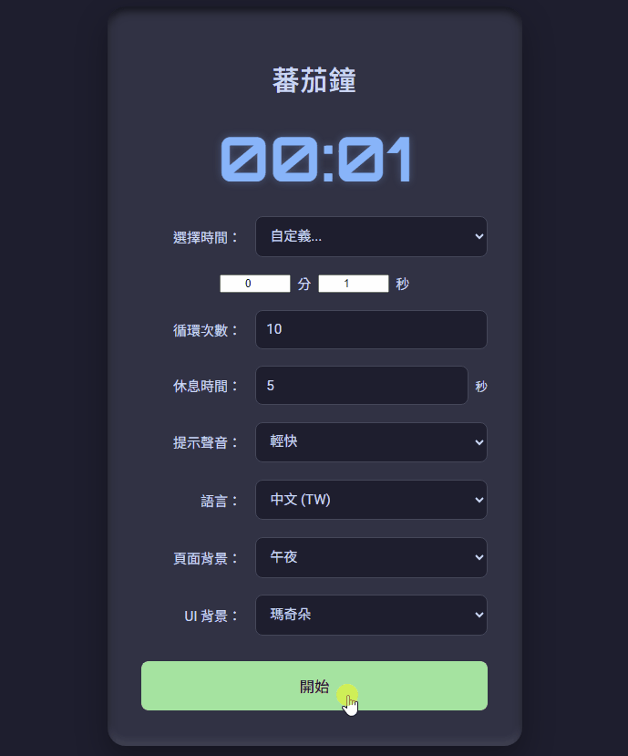

# pomodoro_timer

<div align="center">
A customizable, multi-lingual Pomodoro timer with theme support and synthesized audio alerts, built with pure HTML, CSS, and JavaScript.
</div>

[English](#english) | [中文](#中文)

## <a name="english"></a>English

---

## Features

- **Multi-Lingual Interface**: Instantly switch the entire user interface between Traditional Chinese, English, and Japanese.
- **Flexible Time Control**: Choose from presets (e.g., 10, 15, 25 minutes) or set a custom minute and second duration for your focus sessions.
- **Cycle & Break Management**: Set the number of work cycles and the duration of the break time in between each session.
- **Customizable Themes**: Independently change the page background and the UI background, with multiple light and dark options available.
- **Synthesized Audio Alerts**: Select from multiple synthesized sound effects for cycle completion notifications (powered by Tone.js).
- **No Dependencies**: A single, self-contained HTML file that runs in any modern web browser without needing any installation.

---

### User Interface



---

## Setup & Installation

### 1. Prerequisites
A modern web browser (e.g., Chrome, Firefox, Edge).

### 2. Clone the Repository
```bash
git clone https://github.com/StephenwwW/pomodoro_timer.git
cd pomodoro_timer
````

### 3\. Install Dependencies

No installation is required\! This is a pure front-end application.

-----

## How to Use

1.  After cloning the repository, open the `index.html` file directly in your web browser.
2.  Use the dropdown menus to configure your session: focus time, number of cycles, break length, alert sound, language, and theme.
3.  Click the **Start** button to begin the timer.
4.  Use the **Pause** and **Stop** buttons to control the timer during a session.
5.  A pop-up notification will appear when all cycles are complete.

-----

### License

This project is released under the [MIT License](LICENSE).

-----

## <a name="中文"></a>中文

<div align="center">
一款使用純 HTML、CSS 和 JavaScript 開發，具備主題客製化與合成音效提示的多國語言番茄鐘。
</div>

[View this document in English](#english)

-----

## 功能特色

  * **多國語言介面**: 可隨時在繁體中文、英文、日文之間一鍵切換整個操作介面。
  * **彈性時間控制**: 可選擇預設時間 (例如：10、15、25 分鐘) 或自定義分鐘與秒數，以符合您的專注需求。
  * **循環與休息管理**: 可設定工作循環的總次數，以及每個專注時段之間的休息時間長度。
  * **客製化主題**: 可獨立更換頁面背景與 UI 介面背景，並提供多種淺色與深色主題選項。
  * **合成音效提示**: 提供多種合成音效，用於循環結束時的提醒 (由 Tone.js 驅動)。
  * **無外部依賴**: 單一、獨立的 HTML 檔案，無需安裝即可在任何現代網頁瀏覽器中運行。

-----

### 軟體截圖


-----

## 環境設定與安裝

### 1\. 前置需求

一款現代的網頁瀏覽器 (例如：Chrome, Firefox, Edge)。

### 2\. 複製專案

```bash
git clone https://github.com/StephenwwW/pomodoro_timer.git
cd pomodoro_timer
```

### 3\. 安裝依賴套件

無需安裝！這是一個純前端的應用程式。

-----

## 如何使用

1.  複製專案後，直接在您的網頁瀏覽器中開啟 `index.html` 檔案。
2.  使用下拉式選單設定您的工作階段：專注時間、循環次數、休息長度、提示音效、語言和主題。
3.  點擊 **開始** 按鈕以啟動計時器。
4.  在計時過程中，可使用 **暫停** 和 **停止** 按鈕進行控制。
5.  所有循環結束後會跳出提示視窗。

-----

### 授權條款

本專案採用 [MIT License](LICENSE) 授權。

